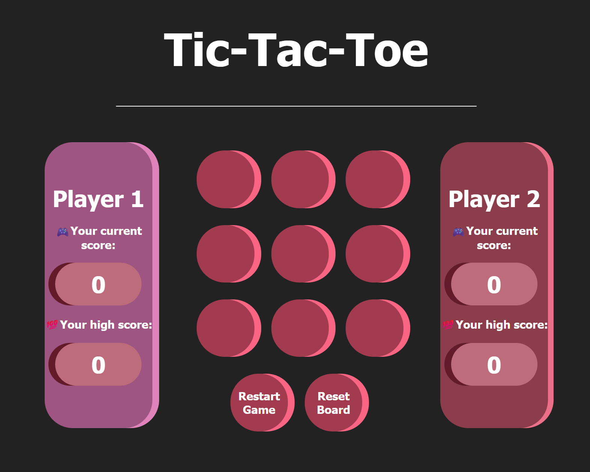

# The TicTacToe Game (HTML/CSS/JS training)

**Version:** 0.0.2
**Author:** [StamosArchontis](https://github.com/StamosArhon)  
**License:** MIT

---

## 📖 About the Project

**The TicTacToe Game** is a simple, fully functional browser-based game built for educational purposes, aimed at practicing fundamental **HTML**, **CSS**, and **JavaScript** skills.

It focuses on:

- Core DOM manipulation
- Event handling
- Simple game logic (player switching, score keeping)
- Responsive and modern UI design using pure CSS

The project is cleanly structured with separated concerns for easy understanding and maintenance.

---

## 🗂️ Directory Structure

```bash
/tictactoe-game-js-training
├── LICENSE
├── /css
│   └── styles.css      # All styling rules (layout, components, effects)
├── /html
│   └── index.html      # Main HTML structure of the game
└── /js
    └── script.js       # Game logic (JS)
```

---

## 🚀 Features

- 🎮 **Two-player mode** (Player 1 vs Player 2)
- ✖️⭕ **Dynamic board filling** with X and O
- 🔄 **Restart Game** button to reset board and scores
- 🔁 **Reset Board** button to clear board without affecting scores
- 🔥 **Active player highlighting**
- 🧠 **Win detection** logic (8 possible winning combinations)
- 💯 **Score tracking** for each player
- 🏆 **High score tracking** persists until full reset
- 💎 **Modern, colorful UI** (hand-crafted CSS)
- 🧹 **Clear board** after each round
- 🎯 **Switch players** automatically after each move

---

## 🛠️ Tech Stack

- **HTML5** (Semantics, Responsive meta)
- **CSS3** (Flexbox, Grid, Animations, Styling)
- **Vanilla JavaScript** (No libraries)

---

## 🖥️ How to Run

1. Clone or download the repository:

```bash
git clone https://github.com/StamosArhon/tictactoe-game-js-training.git
```

2. Open `/html/index.html` in your favorite browser.

✅ No installations or servers are needed — it’s pure frontend!

---

## 🎨 Screenshots

### Gameplay



---

## 📋 Known Limitations

- Players can overwrite each other's moves if the button is not properly locked after clicking (currently partially handled).
- Mobile responsiveness can be improved (future enhancement).

---

## 🛣️ Planned Improvements

- [ ] Improve mobile responsiveness (media queries).
- [ ] Add winning animations.
- [ ] Add a move counter and timer.
- [ ] Track score history between rounds.
- [ ] Add sound effects and accessibility improvements.

---

## 📜 Version History

| Version | Date       | Changes/Notes                                                                                                                                                                                                                                                                                                                      |
| :------ | :--------- | :--------------------------------------------------------------------------------------------------------------------------------------------------------------------------------------------------------------------------------------------------------------------------------------------------------------------------------- |
| 0.0.1   | April 2025 | Initial version. Basic player switching, dynamic board filling, restart functionality, basic layout styling completed. <br> ➕ Added win detection logic and player score tracking. <br> ➕ Added high score tracking per player. <br> ➕ Added **Reset Board** button to clear the board without clearing current or high scores. |

---

## 📄 License

This project is licensed under the **MIT License** — see the [LICENSE](./LICENSE) file for details.

---

## 🤝 Contributions

This project is a training and learning project — but feel free to fork, improve, or extend it if you want!

---
